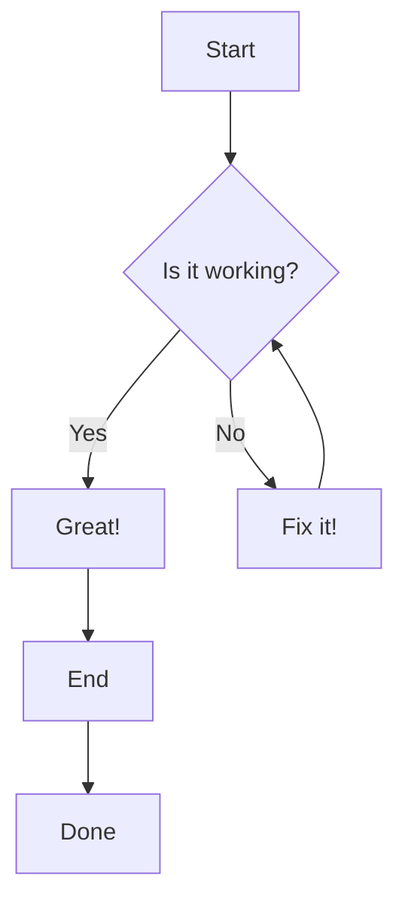

# GFM and Mermaid Test

This file tests the advanced rendering features.

## GFM Table

| Feature         | Supported | Notes                               |
|-----------------|-----------|-------------------------------------|
| Tables          | Yes       | Provided by `goldmark-gfm`          |
| Task Lists      | Yes       | `- [x] Done` `- [ ] Not Done`       |
| Strikethrough   | Yes       | `~~This is strikethrough~~`         |

## Syntax Highlighting

```go
package main

import "fmt"

func main() {
    fmt.Println("Hello, World!")
}
```

## Mermaid Diagram


